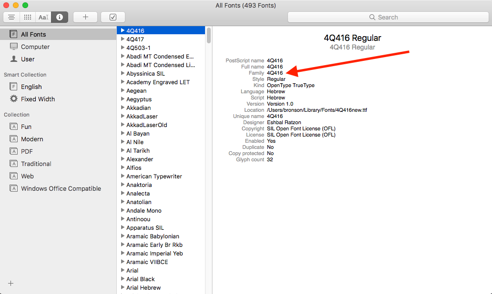

# SQE text to image generator

## Requirements

You will need:

* [Node](https://nodejs.org/en/download/)
  * On Mac I like to use [homebrew](https://brew.sh/): `brew install node`
  * On Ubuntu: `sudo apt-get install nodejs` and `sudo apt-get install npm`, or [use a PPA](https://www.digitalocean.com/community/tutorials/how-to-install-node-js-on-ubuntu-16-04)
* [Yarn](https://yarnpkg.com/en/docs/install#mac-stable)
  * Again, I like homebrew for Mac: `brew install yarn`
  * On Ubuntu: `curl -sS https://dl.yarnpkg.com/debian/pubkey.gpg | sudo apt-key add -`, then `echo "deb https://dl.yarnpkg.com/debian/ stable main" | sudo tee /etc/apt/sources.list.d/yarn.list`, and finally `sudo apt-get update && sudo apt-get install yarn`
* [Chrome](https://www.google.com/chrome/)

When you have these prerequisites, then simply run `yarn --pure-lockfile`, which will install all the necessary dependencies.  If you get errors from Puppeteer (the program that generates the images from browser HTML), the check [here](https://github.com/GoogleChrome/puppeteer/blob/master/docs/troubleshooting.md).

## Usage

The script takes several switches.  It is mandatory to add an `-s` switch followed by the desired scroll_version_id and a `-c` switch followed by the desired col_id:  
`node create-image.js -s 876 -c 9817`

The following switches are optional:

  -i  Sets the session_id token
  -o  Sets output file name (default: "output.png")  
  -f  Sets the output font (uses system names; default: "DSS 4Q51")  
  -h  Sets the height of the line spacing (default: 2)  
  -w  Sets the spacing between words (default: 3)

A command using all of these might look like:  
`node create-image.js -s 876 -c 9817 -o 4Q35-f1.png -f "DSS 4Q51" -h 1 -w 2`

If you want to use custom fonts, you must have them installed on your system.  The script accesses these based on their name within the system.  The easiest way to find this is to open up FontBook, go to the font you want to use, and look at the "Family" designation.

This is the name you want to use with the -f switch; remember to enclose it in double quotes if it has a space in it (i.e., `"DSS 4Q51"`).

